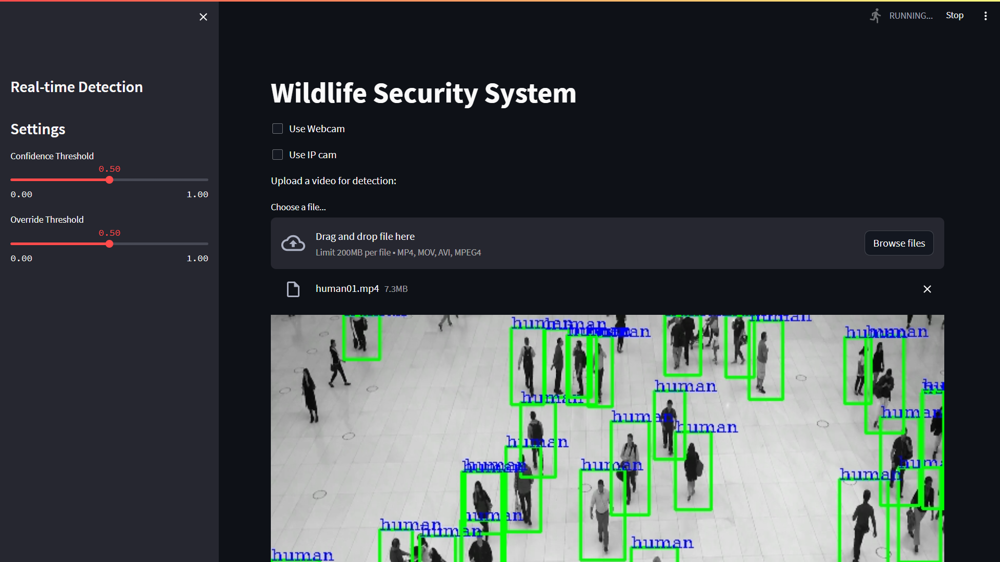

# Wildlife Security System



## Table of Contents

- [About](#about)
- [Demo](#demo)
- [Features](#features)
- [Getting Started](#getting-started)
- [Deployment](#deployment)
- [Usage](#usage)
- [Contributing](#contributing)
- [License](#license)

## About

The Wildlife Security System is a machine vision-based security system designed to detect and alert when specific wildlife or fire events are detected in images or videos. This system utilizes the YOLOv8 model for object detection and integrates it with Streamlit for a user-friendly interface.

## Demo


## Features

- Real-time detection using a webcam.
- Upload and analyze images and videos for wildlife and fire detection.
- Alert mechanism with sound and visual warnings.
- Download processed videos with detected objects highlighted.
- Support for multiple wildlife and fire classes.
- User-friendly interface powered by Streamlit.

## Getting Started

To get started with the Wildlife Security System, follow these steps:

1. Clone this repository:

   ```bash
   git clone https://github.com/itz-kirankumar/Wildlife-Machine-Vision-Security-System

2. Install the required dependencies:
     ```bash
   pip install -r requirements.txt
4. Run the Streamlit app:
     ```bash
   streamlit run app.py


## Deployment
You can deploy this system using various platforms like Streamlit Sharing, Heroku, AWS, or your own server. Choose the deployment option that best suits your needs.

## Usage
1. Open the Wildlife Security System in your web browser.
2. Adjust the confidence and override thresholds in the settings sidebar.
3. Choose between using your webcam for real-time detection or uploading an image/video.
4. If specific wildlife or fire events are detected, you'll receive an alert with a warning sound.
5. Processed videos with detected objects highlighted can be downloaded for further analysis.

## Contributing
Contributions are welcome! If you'd like to contribute to this project, please follow these guidelines:

  1. Fork the repository.
  2. Create a new branch for your feature or bug fix.
  3. Make your changes and commit them.
  4. Create a pull request with a clear description of your changes.

## License
This project is licensed under the MIT License.
